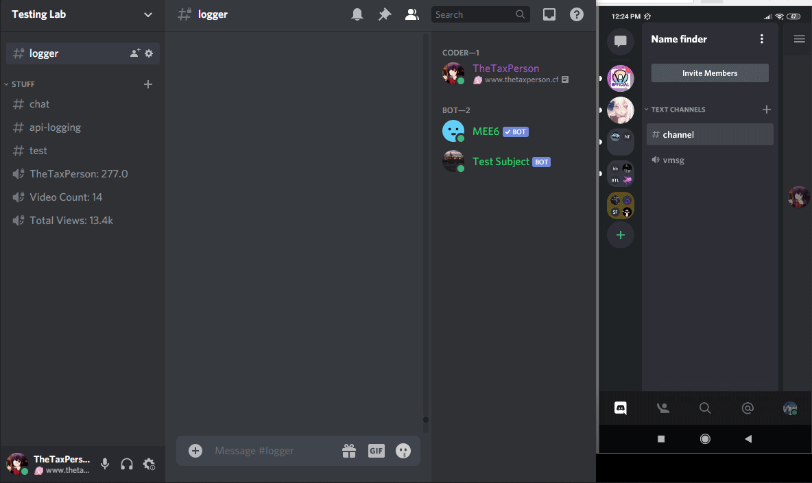
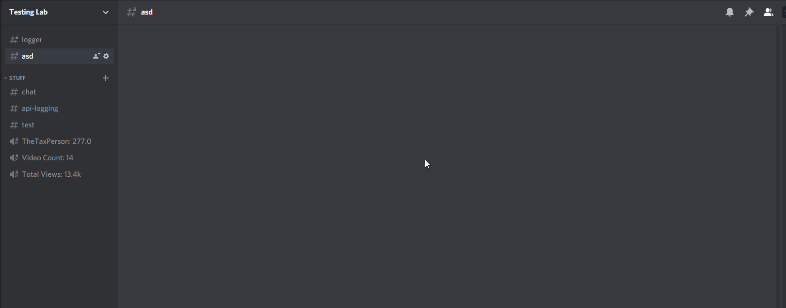

# Discord Chat Bridge
> A DiscordJS v12 bot that bridges the chat between 2 servers.

This is a bot that is made to connect channels between 2 servers making server collaborations enjoyable.



## Installation

```sh
npm i
```
Change the values inside config.json to match your own<br>
Make a webhook on both channels you wanna connect

```sh
node index
```
## Media

Twitter – [@TheTaxPerson](https://twitter.com/TheTaxPerson)

Instagram – [@TheTaxPerson](https://instagram.com/TheTaxPerson)

Youtube – [@TheTaxPerson](https://youtube.com/TheTaxPerson)

Website - [TheTaxPerson.cf](https://thetaxperson.cf)

